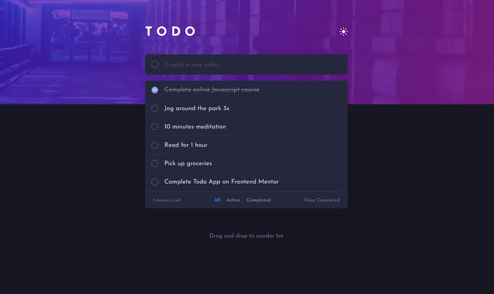

# Frontend Mentor - Todo App

## Table of contents

- [Overview](#overview)
  - [The challenge](#the-challenge)
  - [Screenshot](#screenshot)
  - [Links](#links)
- [My process](#my-process)
  - [Built with](#built-with)
- [Author](#author)

## Overview

### The challenge

Users should be able to:

- View the optimal layout for the app depending on their device's screen size
- See hover states for all interactive elements on the page
- Add new todos to the list
- Mark todos as complete
- Delete todos from the list
- Filter by all/active/complete todos
- Clear all completed todos
- Toggle light and dark mode
- **Bonus**: Drag and drop to reorder items on the list

### Screenshot

### Links

- Solution URL: [Solution URL](https://www.frontendmentor.io/solutions/password-generator-with-reactjs-dNP6gqOmFw)
- Live Site URL: [Live site URL](https://cs-password-generator.netlify.app/)

### Built with

- Semantic HTML5 markup
- Flexbox
- [Sass](https://sass-lang.com/) - CSS Preprocessor
- [React](https://reactjs.org/) - JS library
- [Gatsby.js](https://www.gatsbyjs.com/) - React framework

## Author

- Website - [Creative Portfolio](https://designer-carlyn.github.io/my-porfolio/)
- Frontend Mentor - [Carlo](https://www.frontendmentor.io/profile/designer-carlyn)
- Linkedin - [Carlo Arlyn Segovia](linkedin.com/in/carlo-arlyn-segovia-a25b33158)
